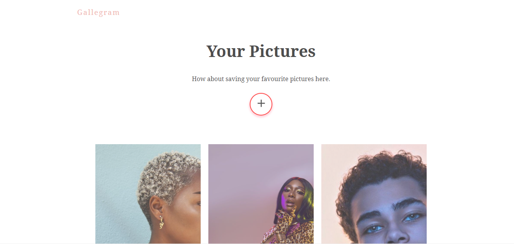

# Gallegram

#### _Gallegram is a photo gallery application which using firebase service for uplaoding and storing the gallery files uploaded by users_

- Powered by
  

##### This project is built with Reactjs : _A javaScript library for building web interface_.

## Screen Shots



## Features

- Modal view with framer motion animation
- Animated progress bar
- Retrieve uploads instantly.

### Built with

- CSS custom properties
- Flexbox
- CSS Grid
- Framer Motion
- Mobile-first workflow
- React Hooks / Custom hooks
- [Firebase](https://firebase.com) - google firebase
- [React](https://reactjs.org/) - JS library

In the project directory, you can run:

### `npm start`

Runs the app in the development mode.<br />
Open [http://localhost:3000](http://localhost:3000) to view it in the browser.

The page will reload if you make edits.<br />
You will also see any lint errors in the console.

```

> Author: `--EBUKA Victor`.


## License

MIT
```
